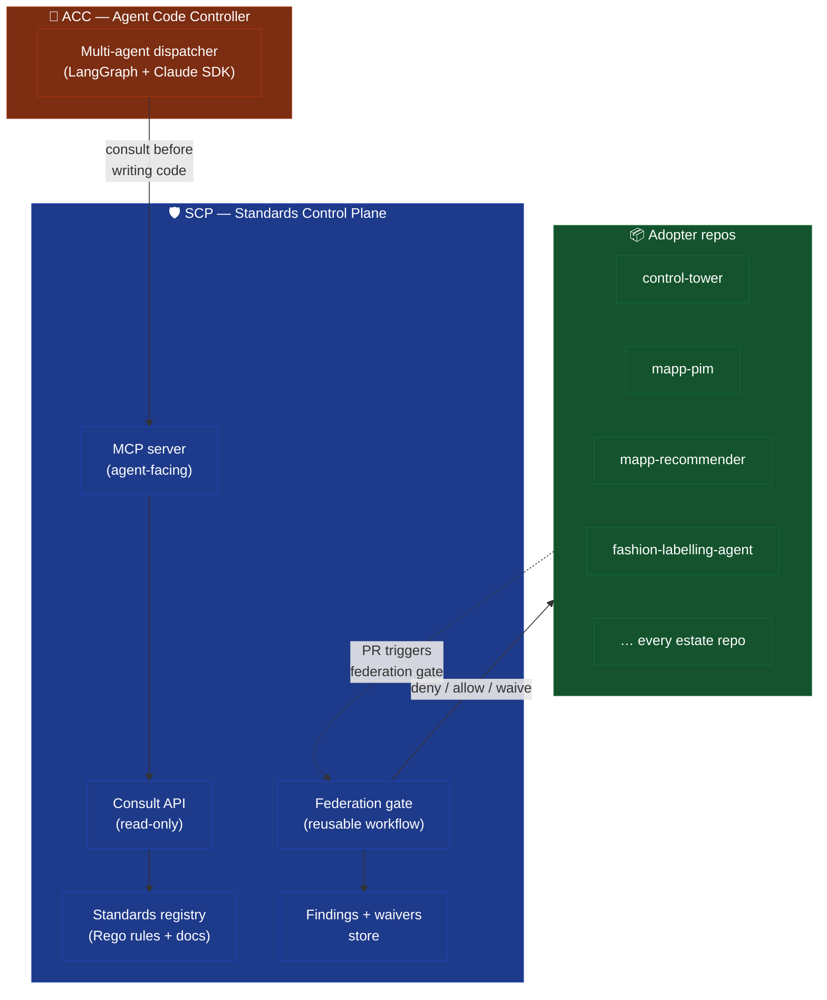
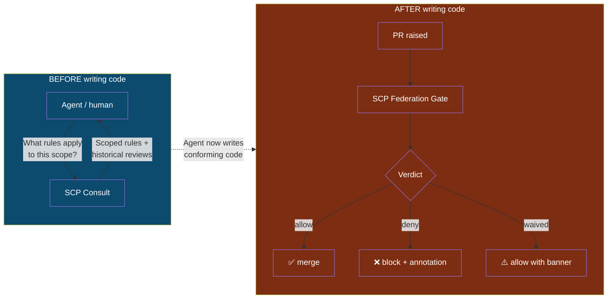
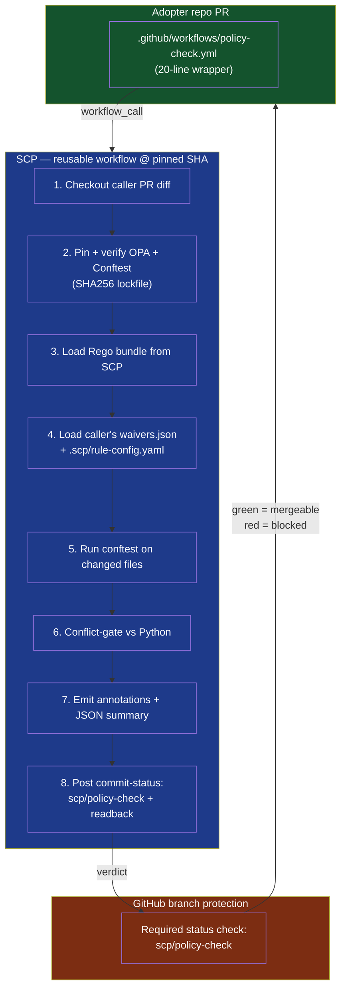
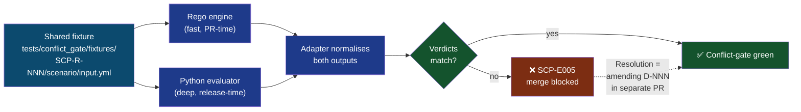
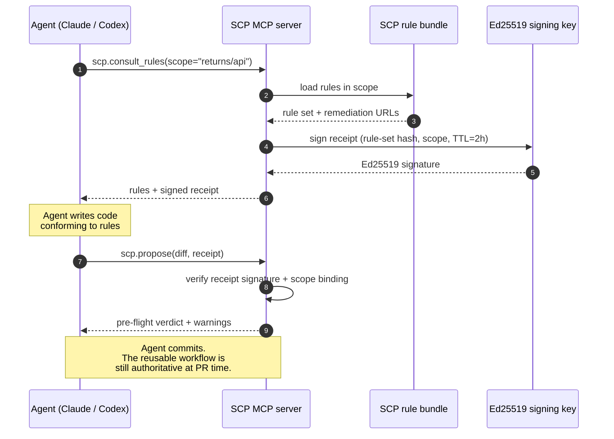
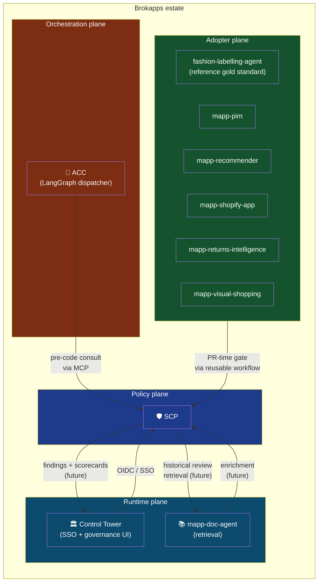
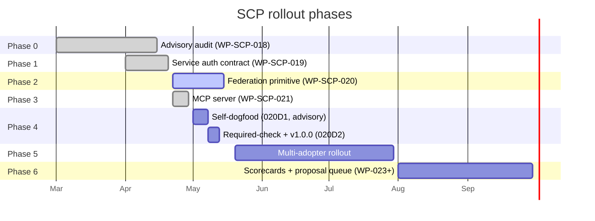
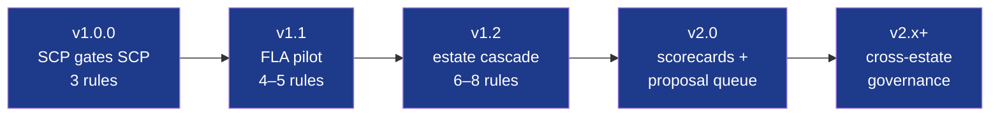

# Standards Control Plane

### What it does, how it's enforced, how it evolves

James Brooke • 2026-04-30 • walk-through draft

---

## How to read this deck

- **Format:** plain markdown, but Marp-compatible. Render with `marp docs/decks/SCP-overview-2026-04-30.md --html` if you want a slide-show version. Reads fine as scrollable docs on GitHub.
- **Diagrams:** Mermaid blocks, render natively on GitHub.
- **Speaker notes:** plain text below each slide's headline content. Walk through them out loud; the deck is the structure, the notes are the substance.

> **One-line elevator pitch.** SCP is the deterministic policy plane that tells every agent and every PR in the estate what "good" means — and blocks merges that disagree.

---

## 1. The problem we're solving

We have multiple repos, multiple humans, and increasingly multiple **AI agents** authoring code in parallel. Without a shared source of truth for "what's allowed," each repo drifts, each agent invents its own house style, and governance becomes *retrospective* — we only find out something's wrong after a human reviewer notices.

**Three concrete pains we hit before SCP:**

1. **Drift.** Each repo's `services.yml`, waiver schema, vendoring conventions diverged. Reviews argued style, not substance.
2. **Agents inventing standards.** Codex/Sonnet/Opus would pick a plausible pattern but not necessarily *our* pattern. Review caught it; the wasted dispatch didn't.
3. **No enforcement floor.** Decisions in `docs/DECISIONS.md` were *aspirational* — nothing forced a downstream PR to honour them.

**The bet:** if standards become *machine-readable* and *machine-enforceable*, and every agent has to *consult them before writing code*, drift collapses and review becomes about novel substance, not boilerplate.

---

## 2. What SCP is — three sentences

> **SCP is a deterministic policy plane.**
> It exposes "what's allowed" in two flavours: a **consult API** that agents query *before* writing code, and a **federation gate** that blocks merges *after* writing code if the result violates a rule.
> It is not a service runtime, not a chat forum, not a workflow orchestrator — those live elsewhere in the estate.

**What SCP owns:**
- Source of truth for governance + architecture standards (Rego rules + structured docs)
- Findings store, waivers, scorecards
- Consult interface (humans + agents)
- Audit interface (CI + scheduled review + release-gate)
- Federation primitive (reusable workflow that downstream repos pin)

**What SCP does NOT own:**
- Multi-agent orchestration → that's **ACC**
- Service runtime / auth fabric → that's **Control Tower**
- Documentation retrieval → that's **mapp-doc-agent**

The clean boundary is the whole point. SCP plugs into the estate; it doesn't try to *be* the estate.

---

## 3. The three-layer architecture



**Read this diagram top-to-bottom:**
- **SCP** at the top: the *policy* layer. Knows what's allowed. Stores findings. Speaks two protocols: MCP (for agents) and reusable-workflow (for PRs).
- **ACC** in the middle: the *orchestration* layer. When you ask ACC to "build feature X," ACC's dispatcher consults SCP *before* dispatching the executor agent. Result: the agent writes code that already conforms.
- **Repos** at the bottom: the *execution* layer. Every PR they raise calls back up to SCP's federation gate. Result: drift caught at PR time, not release time.

The arrows are the *contract*. Adopter repos do not need to know SCP's internal data model — they just pin the workflow.

---

## 4. Two operating modes — consult vs audit



**Why two modes?**

The federation gate alone (audit-only) has a UX problem: agents waste a dispatch cycle, find out at PR time, then have to redo the work. The consult API closes that loop *before* code exists. Belt and braces.

| Mode | When | Who calls it | What it returns |
|---|---|---|---|
| **Consult** | Pre-code | Agents (via MCP), humans (via CLI / web) | Scoped rule list + historical review references for the area being changed |
| **Audit** | Post-change | CI (via reusable workflow), release-gate (via tag-cut) | Structured findings, waiver-aware verdicts, machine-readable summary JSON |

Both modes share the same **standards registry** and the same **Rego rule bundle**. There is *one* source of truth — there's no risk of consult and audit disagreeing.

---

## 5. The enforcement stack — federation primitive



**Anatomy of the federation primitive:**

1. **Caller wrapper** is ~20 lines. Pinned by commit SHA, not tag. Renovate cascades the bump on every SCP release.
2. **Reusable workflow** does all the heavy lifting. Versioned semantically (`v1.0.0`, `v1.1.0` …). Adopters move at their own pace.
3. **Rego bundle** = the machine-readable rules. Three rules in v1.0.0 (deliberately small).
4. **Waivers** are caller-controlled (in *their* repo at `output/findings/waivers.json`). SCP doesn't centralise exception management — that would couple every adopter to SCP's release cadence.
5. **`.scp/rule-config.yaml`** is also caller-controlled. Lets a repo *temporarily disable* a rule with a justification + expiry date. Drift visible to estate scorecards.
6. **Conflict-gate** runs the same fixture against both engines (Rego + Python evaluator). If they disagree, merge is blocked pending an amending decision record. Python is the deep-audit reference; Rego is the fast PR gate.
7. **Branch protection** makes `scp/policy-check` a *required* status check. SCP itself self-dogfoods this: 020D2 turns it on for SCP's own `main`.

**Security floor:** OPA + Conftest binaries pinned by SHA256 in a lockfile. Caller's `GITHUB_TOKEN` is the *ceiling* — the reusable workflow declares no `secrets:`. Break-glass requires three gates (CODEOWNERS approval + paired D-NNN + waiver entry). Nothing can be bypassed silently.

---

## 6. What v1.0.0 actually checks — the three rules

We deliberately capped v1.0.0 at **exactly three rules**. The bet is that the *primitive* matters more than the *rule library*. Once enforcement works, rules 4–N follow via the RFC process in v1.1+.

| ID | What it checks | Why this rule first |
|---|---|---|
| **SCP-R-001** | `services.yml` root-shape conforms to SVC-003 auth modes (`mode.user_oidc`, `mode.service_rs256`, `mode.api_key`, `mode.bearer_legacy`) | Auth-contract drift is the highest-blast-radius failure mode in the estate. WP-SCP-019 froze the schema; this rule enforces it. |
| **SCP-R-002** | `waivers.json` entry schema — `approved_by`, `created_at`, `expires_at`, `rule_id` ∨ `finding_id` | Waivers are the safety valve. If their *shape* drifts, the safety valve becomes opaque. v1.0.0 narrowed scope to null/string-rooted detection (TF-008 tracks dict-shape extension to v1.1). |
| **SCP-R-003** | ADOPT-001 §11 vendoring-manifest marker is present in `package.json` / `pyproject.toml` / `go.mod` when those files change | Marks every adopter repo as having *consciously adopted* the SVC-003 contract. PRs that touch a manifest file without the marker are evidence of un-onboarded change. |

**Each rule:**
- Emits a structured deny: `{rule_id, file, message, remediation_url}`.
- Has fixtures under `policies/testdata/<rule-id>/{allow,deny}/`.
- Has `opa test` coverage ≥ 90%.
- Is waiver-aware via `policies/scp_common.rego` shared helpers.
- Is rule-config-aware via the same helpers.

The full rule template + checklist lives at `policies/README.md` — that's the contract for adding rule 4+.

---

## 7. The conflict-gate — why two engines



**Why bother running two engines?**

- **Rego (via OPA + Conftest)** is fast and easy to reason about. It's the PR-time gate.
- **Python evaluator** is the historical reference. It can do deeper analysis (e.g., regex over markdown, semantic checks on YAML graphs).
- **Risk:** the two could silently diverge. A rule that *looks* enforced in CI might in fact be a no-op because the deep evaluator fires on a shape the Rego version misses.

The conflict-gate makes that **structurally impossible**. Every fixture must produce the same verdict on both engines. Disagreement → SCP-E005 → merge blocked → human writes an amending decision row → fixture's expected verdict updates → both engines re-run → green.

This is the *architectural insurance* against "we have a Rego rule for X" silently becoming "we *had* a Rego rule for X."

---

## 8. The MCP server — agent-facing surface (Track 2)



**Why an MCP server?**

The federation gate catches drift at PR time. That's *late* — the dispatch cycle is already spent. The MCP server moves consult *before* the agent writes code.

**Surface (v0.3 plan, 7 tools):**
- `scp.consult_rules(scope)` — what rules apply to my area?
- `scp.list_decisions(area)` — what amending D-NNN rows are relevant?
- `scp.list_findings(repo)` — what's the open-finding state?
- `scp.list_waivers(repo)` — what's currently suppressed?
- `scp.propose(diff, receipt)` — pre-flight check before commit
- `scp.search(query)` — full-text over standards
- `scp.health()` — readiness probe

**Receipts are the trust mechanism.** When an agent calls `consult_rules`, it gets a receipt signed with SCP's Ed25519 key. The receipt binds: `(rule-set hash, scope, TTL ≤ 2h)`. When that agent later calls `propose`, it must present the receipt — ensuring it *actually consulted* before writing code, and consulted the *correct scope*.

**Authoritative gate is still the reusable workflow.** The MCP server is *advisory* in the sense that an agent could ignore it. But the federation gate at PR time will catch any mismatch. Belt + braces.

**Status:** Track 2 closed 2026-04-29 (USER-GATE-C signed). Slices 021A–021E landed. HTTP transport (021F) and signed-receipt verification client (021G) deferred to post-Threshold A.

---

## 9. How it integrates with the rest of the estate



**The integration story, repo by repo:**

- **ACC** (`~/Projects/acc`) is the multi-agent dispatcher. Before it dispatches an executor agent, it calls `scp.consult_rules` via MCP. The agent writes pre-conforming code. *Already integrated at the plan-decompose stage.*
- **Control Tower** owns SSO. SCP authenticates browser users via CT OIDC. Future direction (post-Threshold A): SCP findings surface in CT's governance UI, and CT's release-management surface reads from SCP's scorecards.
- **mapp-doc-agent** owns retrieval. Future direction: SCP enriches consult responses with relevant historical reviews retrieved from doc-agent. Today this is a stub — the architecture is staged so it can land without breaking the consult contract.
- **Adopter repos** (FLA, PIM, recommender, shopify-app, returns, visual-shopping) all call the federation primitive via the wrapper. FLA is the *reference gold standard* — the most mature adopter, the template for cascading the rest.

**The estate boundary is deliberate.** SCP doesn't try to be ACC + CT + doc-agent + every repo. It's a *plane*, not a platform.

---

## 10. How it evolves over time — phased rollout



**Read this as a timeline of *trust*:**

| Phase | What changes | Risk profile |
|---|---|---|
| **Phase 0** (done) | Advisory post-merge audit. SCP runs after the fact. Findings logged, no enforcement. | Zero — purely diagnostic |
| **Phase 1** (done) | Auth-contract schema frozen. WP-SCP-019 closed 2026-04-20. Three approved modes (`user_oidc`, `service_rs256`, `api_key`) + one deprecating mode (`bearer_legacy`). | Low — schema-only |
| **Phase 2** (in flight) | Pre-merge federation primitive. Reusable workflow + Rego bundle + Renovate cascade. SCP self-pilots. | Medium — first PR-time enforcement, single-repo blast radius |
| **Phase 3** (done) | MCP server. Agents consult before writing code. Track 2 closed 2026-04-29. | Low — advisory only |
| **Phase 4** (next) | SCP gates *its own main*. Advisory → required. v1.0.0 cut. Threshold A reached. | High — irreversible-ish, single-repo blast radius |
| **Phase 5** (mid-2026) | Multi-adopter rollout. FLA pilot first, then estate cascade. | Medium — staged, reversible per-adopter |
| **Phase 6** (Q3 2026) | Scorecards + proposal queue + cross-repo D-NNN indexing. | Low — observability layer |

**Notice the pacing.** Each phase is *one mechanism*, not a bundle. The federation primitive landed before MCP because: a working PR-time gate is the *audit floor* — the MCP server is a UX optimisation on top of that floor. Build the floor first, optimise after.

---

## 11. Threshold A — the v1.0.0 finish line

> **Definition:** SCP gates itself on its own `main` via the federation primitive's reusable workflow with a required-status-check, all three v1.0.0 Rego rules enforcing, conflict-gate green on every PR, and a v1.0.0 release tag cut.

That's it. That's the operational finish line. From the user's stated phrasing: "actually useful."

**Where we are this morning (2026-04-30 AM):**

```
020A    plan + D-022/D-023                        ✅
020B    reusable workflow                         ✅ PR #36
020B.1  workflow-selftest harness                 ✅ PR #38
020B.2  scripts/scp-policy-check local repro      ✅ PR #41
020C    3 starter Rego rules                      ✅ PR #49
020C.1  waiver-aware + conflict-gate + read-back  ✅ PR #52
020J    tag-protection v* + signed-commits        ✅ PR #53 (this morning)
020K    adopter onboarding + ADOPT-005            ⏳ next
020D1   self-dogfood wrapper (advisory)           ⏳ HIGH-RISK
020H.1  v1.0.0-rc.1 + observability emit          ⏳
020E.a  pre-protection canary                     ⏳
🛑 USER-GATE-A0  advisory→required signoff         ⏳ ← human signoff
020H.2  observability dashboards                  ⏳
020D2   required-status-check + cut v1.0.0        ⏳
🛑 USER-GATE-A  Threshold A signoff               ⏳ ← finish line
```

**Risk-weighted ETA (per the planning session):**
- **Floor:** by end of next session, 020D1 is past.
- **Mid case:** USER-GATE-A0 awaiting signoff.
- **Stretch:** Threshold A reached.

The big tail risk is **020D1** — first time SCP gates its own PRs in a real-PR setting. The synthetic selftest harness already passed; the real harness will surface coverage gaps. Same pattern as the 020C.1 CI fixpoint dance, just in a real-PR setting instead of a synthetic one.

---

## 12. Why this is worth doing — the benefits

**For the estate (the "why now"):**

1. **Drift collapses.** Three rules today, ten by Q3. Every adopter repo is held to the same schema. PRs become about novel substance, not formatting.
2. **Agents stop inventing standards.** MCP consult means every dispatch starts with "what's allowed in this scope?" — written in machine-readable Rego, signed by SCP, time-bound by receipt.
3. **Review effort goes to the interesting bits.** Style, schema-shape, and waiver-shape concerns are caught in CI. Human review handles design, scope, and intent.
4. **Governance becomes reproducible.** `policies/` is a git tree. Rule changes go through RFC. Waivers expire. The system *enforces its own rules about itself*.

**For the operator (you — the "why this design"):**

5. **Single-source-of-truth, not single-point-of-failure.** SCP doesn't run the estate; it tells the estate what's allowed. If SCP is down, every existing PR still works (the workflow caches). You're not adding a runtime dependency.
6. **Cascading bumps via Renovate.** When SCP releases v1.1, every adopter's pin bump opens automatically. Adopters move at *their* pace — Renovate proposes, the adopter merges (or doesn't).
7. **Bus-factor honesty.** `CODEOWNERS` is a single name today. The 020J / 020K design *acknowledges* bus-factor-1 explicitly (quarterly review cadence) instead of pretending the estate has a team.
8. **Conflict-gate is structural insurance.** You can't accidentally have a rule that *looks* enforced but silently doesn't fire. The two engines must agree, or merge is blocked.

**For future agents and humans (the "why this lasts"):**

9. **Standards evolve, not deprecate.** RFC-lite + one-release deprecation window. Rules can be added, narrowed, tightened, retired — without breaking adopters.
10. **Receipt-bound consults are auditable.** Every "the agent consulted SCP before writing this" is a signed receipt with a TTL. Forensic trail by default.

---

## 13. Where we are today (snapshot)

**Programmes:**
- WP-SCP-019 (Service Auth Contract) — ✅ closed 2026-04-20
- WP-SCP-020 (Federation Primitive) — 🔄 ~60% slices done, Threshold A 1–2 sessions out
- WP-SCP-021 (MCP Server) — ✅ landed 2026-04-29 (USER-GATE-C signed)
- WP-SCP-022 (Implementation Programme) — 🔄 in flight, orchestrates 020 + 021

**Live infra (today):**
- Repo `main` has `required_signatures: true` (this morning's 020J merge)
- Tag-protection ruleset on `v*` (no force-push, no deletion, no re-pointing)
- 3 Rego rules under `policies/`
- Reusable workflow at `.github/workflows/policy-check.yml`
- Conflict-gate adapter at `tests/conflict_gate/adapter.py`
- MCP server at `src/standards_control_plane/mcp/`
- Ed25519 signing key under `.scp/keys/`

**What blocks Threshold A:**
1. Slice 020K — adopter onboarding doc + ADOPT-005 self-cert.
2. Slice 020D1 — SCP self-dogfood wrapper. *First time SCP gates its own PRs.* High-risk slice; expect a 020C.1-class CI fixpoint dance.
3. Slice 020H.1 — cut v1.0.0-rc.1.
4. Slice 020E.a — pre-protection canary (deliberate violation demonstrates deny).
5. **USER-GATE-A0** — your signoff to flip advisory → required.
6. Slice 020D2 — turn the required check on. v1.0.0 cut.
7. **USER-GATE-A** — Threshold A signoff.

---

## 14. Post-v1.0.0 — what comes next

**v1.1 (rules + adopters):**
- Rule 4+ via the RFC-lite process. Candidates: deny-by-default JSON-schema conformance (SCP-074), path-scoped SCP-R-002 (TF-008), whole-tree adoption-sweep mode.
- FLA pilot: first non-SCP adopter on the federation primitive. Validates the cascade.
- Renovate preset stabilisation across multi-adopter rollout.

**v1.2 (estate cascade — WP-SCP-024):**
- Required check enabled across `{pim, recommender, shopify-app, mapp-doc-agent, control-tower, returns-intelligence, visual-shopping, ...}`.
- Per-adopter onboarding via `scripts/scaffold-downstream.sh` (SCP-073-scaffolder).

**v2.0 (observability + adjudication — WP-SCP-022 proposal-queue + WP-SCP-023):**
- Cross-repo scorecards aggregating JSON summaries.
- Proposal queue: structured RFC-lite for new rules, with explicit adjudication.
- Cross-repo D-NNN indexing.

**Long-tail:**
- HTTP transport for MCP (021F) — currently stdio-only.
- Signed-receipt verification client (021G) — for adopters who want to verify SCP-issued receipts.
- mapp-doc-agent enrichment of consult responses (currently stubbed).
- Control Tower governance-UI surfacing (currently stubbed).

**The shape of evolution:**



Each version *adds capability* without breaking adopters. Pin-bump via Renovate is the upgrade path. No flag-day migrations.

---

## 15. The walk-through is over — what to ask

If something didn't land in this deck, the question to ask back is probably one of:

- **"How does SCP know about *my* repo?"** → it doesn't, until your repo adds the wrapper workflow + Renovate preset. SCP is *opt-in by pin*, not opt-in by registration.
- **"What if I disagree with a rule?"** → `.scp/rule-config.yaml` lets you disable a rule with a justification + expiry. Visible to estate scorecards. RFC-lite for permanent changes.
- **"What if SCP is down?"** → the workflow has a vendored binary fallback path. Cached SHA-pinned binaries mean no runtime dependency on SCP infra.
- **"Can I run it locally?"** → yes, `scripts/scp-policy-check` reproduces the CI invocation locally. SHA-locked binaries; same Rego bundle.
- **"What does break-glass look like?"** → three gates: CODEOWNERS approval + paired D-NNN row + matching waiver entry. All three must be present in the same PR. Fails closed otherwise.
- **"Why not centralise waivers?"** → that would couple every adopter to SCP's release cadence. Caller-controlled `waivers.json` keeps the safety valve in the adopter's hands.

**Things this deck deliberately doesn't cover:**
- The wire-format details of MCP messages (see `docs/plans/WP-SCP-021-scp-as-mcp-server.md`).
- The exact Rego pattern for waiver-aware deny rules (see `policies/scp_common.rego` + `policies/README.md`).
- The slice-by-slice CI fixpoint history of 020C.1 (see `docs/reviews/WP-SCP-022/CONTINUATION-PROMPT-2026-04-30-am.md` table).
- The gate-helper / dispatcher / four-tier pattern (orthogonal — that's *how SCP gets built*, not *what SCP does*).

> **The deck's job is the mental model. The docs above are the substance.**

---

## Appendix — read these next

| Doc | Why |
|---|---|
| `docs/plans/WP-SCP-020-policy-federation-primitive.md` | The federation primitive's full design, slice-by-slice. |
| `docs/plans/WP-SCP-021-scp-as-mcp-server.md` | The MCP server's full design + receipt model. |
| `docs/plans/WP-SCP-022-implementation-programme-plan.md` | How both above tracks are sequenced + the gate-by-gate roadmap. |
| `docs/adoption/ADOPT-001-project-onboarding.md` | The single onboarding brief for adopter repos. |
| `docs/integrations/conflict-gate.md` | Conflict-gate adapter doctrine. |
| `docs/security/branch-protection.md` | 020J configured-state docs + verify + revert. |
| `docs/DECISIONS.md` | Every amending D-NNN decision row. |
| `policies/README.md` | Rule template + 7-step contributor checklist. |
| `STATUS.md` (on `main`) | At-a-glance Threshold A progress + active PRs + scheduled follow-ups. |

> *End of walk-through.*
